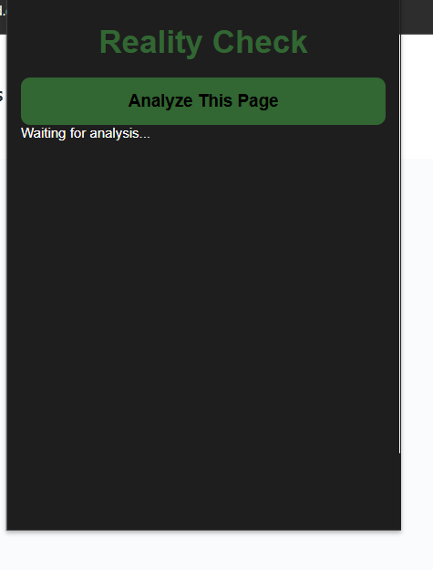
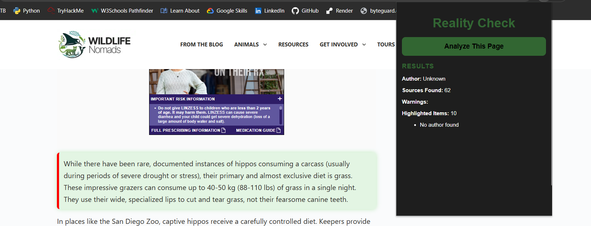

# Reality Check
Currently in development.

A Chrome extension that analyzes web pages and provides quick credibility indicators.4

## Visit the Chrome Store: https://chromewebstore.google.com/detail/reality-check/hceklndiknojhimmebmgljacnpbfabjl

### Screenshot

## Features

- Detects source citations
- Checks for author attribution
- Flags claims that do not appear to have supporting sources

### Detecting Unsupported Claims

## Current Status

Prototype / MVP

## Future Plans

- Better credibility scoring
- Fact-check API integration
- Bias detection
- Visual trust indicators
- Source quality ranking
- AI-generated content detection

## Tech Stack

- HTML
- CSS
- JavaScript
- Chrome Extensions API

## Author

Ali Anderson
